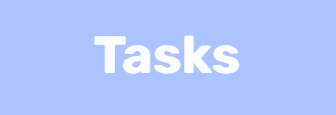
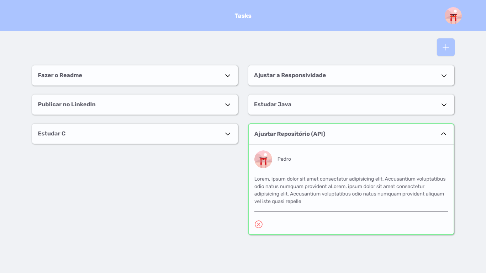

<p align="center">
  
</p>

<h1 align="center">
  
</h1>

## 🧪 Tecnologias

Esse projeto foi desenvolvido com as seguintes tecnologias:

- React
- TypeScript
- StyledComponents
- Axios

## 🚀 Como executar

Para iniciar o projeto, siga os passos abaixo:

```bash
# Instalar as dependências (Npm ou Yarn)
$ yarn || npm install

# Iniciar o projeto (Npm ou Yarn)
$ yarn start || npm run start
```

O projeto estará disponível no seu navegador pelo endereço http://localhost:3000.

Para o funcionamento do site, você deverá baixar o projeto [Tasks-API](https://github.com/xpedroleonardo/Tasks-API), e seguir os passos contidos nele, para que os projetos se comuniquem.

## 💻 Projeto

Taks é um lugar para você organizar as tarefas pendentes, que você precisa realizar. E te informa quais tarefas você já concluiu.

- [x] Design Responsivo
- [x] Projetos salvos em banco de dados
- [x] Dados atualizados dinamicamente

## 📝 License

Esse projeto está sob a licença MIT. Veja o arquivo [LICENSE](LICENSE) para mais detalhes.

---

Feito com ❤ by [Pedro Leonardo](https://github.com/xpedroleonardo)
